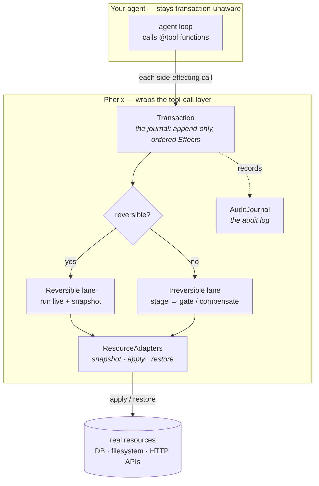

# Pherix — nothing your agent does half-happens

**A transactional resource runtime for AI agents: undo the reversible · gate the irreversible — against your backend's own state.** Audit, replay, and isolation fall out for free.

Pherix is a Python **library** (+ TypeScript SDK) that wraps your agent's tool-call layer and gives database-style guarantees — atomicity, isolation, capability enforcement, durability — over the *external side-effects* of the tool calls (DB writes, file writes, API calls). It does **not** run your agent or call any LLM. You keep your existing agent loop and model provider; Pherix sits underneath at the tool-call layer. Every side-effecting call becomes an entry in one append-only journal — `commit()` folds it forward, `rollback()` folds it back.

**What it is *not*:** not durable execution (Temporal replays your *code*; Pherix transacts your *resources*), not observability (LangSmith/Langfuse *watch*; Pherix *enforces and reverses*), not an agent framework (it wraps the tool calls of an agent you already have).

## How it works



Every side-effecting tool call becomes an `Effect` appended to the journal. **`commit()` folds the journal forward** (`apply` each effect); **`rollback()` folds it backward** (`restore` the snapshot, or run the compensator). Reversible effects run live and undo via the backend's own savepoints; irreversible ones stage and only fire at commit — gating on approval if they can't be undone. Same engine, two directions.

## Who it's for

Anyone shipping action-taking agents to production — where a tool call writes to a database, touches the filesystem, or fires an irreversible API request, and "the effect just happened" is not good enough.

## Quickstart

> Pre-release. The wrap below *is* the whole integration — no migration, no rewrite: declare your side-effecting tools, wrap the run.

> **Using a coding assistant?** Point Claude Code / Cursor / Aider at [`llms-full.txt`](llms-full.txt) — a complete, executable integration recipe (with the gotchas spelled out) written so an LLM can wrap your agent in Pherix correctly without you fighting the API. [`llms.txt`](llms.txt) is the curated index of all docs.

**Install**

```bash
pip install pherix
```

<sub>Or from source: `git clone https://github.com/LukeyP02/Pherix && cd Pherix && pip install -e .`</sub>

**Run it — 30 seconds, no API key, no network.** One reversible DB write that rolls back, one irreversible send that gates at commit:

```bash
python examples/quickstart.py
```

```
=== rollback ===
  inside txn:       ['ada']
  after rollback:   []            # the write was undone — nothing persisted

=== gate (not approved) ===
  commit blocked:   ... staged irreversible effects need approve_irreversible(): <effect-id>
  emails sent:      []            # the un-undoable send never fired
  users persisted:  []            # and the DB write rolled back with it

=== gate (approved) ===
  emails sent:      [('grace@example.com', 'welcome')]
  users persisted:  ['grace']     # approved → both go through
```

That's the whole idea in one run: the reversible effect is undone exactly, the irreversible one is held until a human says yes. The [40-line source](examples/quickstart.py) is the minimal real wrap; the rest of this section walks through each piece.

**1 — Declare your tools with `@tool`.** Mark each side-effecting function with the resource it touches. The agent body that calls them stays transaction-unaware — just a plain loop.

```python
import sqlite3
from pherix import AuditJournal, SQLiteAdapter, agent_txn, tool

@tool(resource="sql")
def insert_user(conn, name, role):
    conn.execute("INSERT INTO users (name, role) VALUES (?, ?)", (name, role))
    return name

def my_agent(team):
    # a plain agent loop — never transaction-aware
    for name, role in team:
        insert_user(name=name, role=role)
```

**2 — Wrap the run in `agent_txn(...)`.** Pass your adapters. Reversible effects journal live and roll back on demand; leaving the block cleanly commits them.

```python
conn = sqlite3.connect("app.db", isolation_level=None)
audit = AuditJournal.in_memory()
adapters = {"sql": SQLiteAdapter(conn)}

with agent_txn(adapters, audit=audit) as txn:
    my_agent([("ada", "engineer"), ("grace", "scientist")])
    # caught a problem? roll the whole step back — nothing persisted:
    # txn.rollback()
# left the block cleanly → commit. The writes are now durable.
```

**3 — Irreversible effects gate.** Declare `reversible=False`. Add a `compensator` (a semantic inverse) if one exists; otherwise the effect blocks at commit until explicitly approved.

```python
from pherix import HTTPAdapter, GateBlocked

@tool(resource="http", reversible=False, injects_handle=False)
def refund_charge(customer, amount):           # the semantic inverse
    stripe.refund(customer, amount)

@tool(resource="http", reversible=False, injects_handle=False,
      compensator="refund_charge")
def charge_card(customer, amount):             # auto-commits; refunded on rollback
    return stripe.charge(customer, amount)

@tool(resource="http", reversible=False, injects_handle=False)
def send_email(to, body):                      # no inverse — an email can't be un-sent
    stripe.email(to, body)

adapters = {"sql": SQLiteAdapter(conn), "http": HTTPAdapter()}
with agent_txn(adapters, audit=audit) as txn:
    charge_card(customer="alice", amount=4200)
    receipt = send_email(to="alice@example.com", body="receipt")
    # send_email has no compensator → commit BLOCKS at the gate until a human
    # (or a higher-trust policy) approves the un-undoable effect:
    txn.approve_irreversible(receipt.effect_id)
# no approval → GateBlocked is raised and the staged effects never fire.
```

Reversible effects run live and roll back via the backend's own savepoints. Irreversible ones are *staged* — they only actually happen at commit, and an un-compensable one gates on explicit approval. Calling `rollback()` before commit means the irreversible effect simply never happened. That's the whole point.

## What you get

- **Undo the reversible** — DB and file writes roll back via the backend's own savepoints.
- **Gate the irreversible** — un-undoable effects stage and block at commit until approved.
- **Audit everything** — every effect, its arguments, and its outcome lands in the journal; the journal *is* the audit log.

## See it / explore

```bash
python examples/demos/undo.py        # a wrong-but-allowed bulk write, rolled back live — 40k rows restored, 0 lost
python examples/demos/gate.py        # an irreversible wire, held at the gate then cleared on approval
python examples/demos/isolation.py   # two agents race the same row — the stale read is rejected
python examples/demos/authority.py   # the same irreversible purge, two actors, opposite fate
python examples/demos/lineage.py     # which reads informed a write — provenance, read back from the journal
```

Each is self-contained, deterministic, and offline — the flagship is `undo.py`: a plausible, policy-allowed `UPDATE` with an over-broad `WHERE` runs live against real SQLite behind a `SAVEPOINT`, then one `rollback()` does `ROLLBACK TO SAVEPOINT` and every row is restored — exact, by the backend, not a guessed inverse. Every demo ends by pointing you at the journal it produced:

```bash
python -m pherix.inspector.seed demo.db   # generate a representative audit journal
python -m pherix.inspector --db demo.db   # open the read-only audit console over it
```

Runs fully offline — no API key, no model. The seeded journal shows every story the console renders: a clean commit, a rollback, a gated irreversible, a STUCK transaction, and a dry-run.

## Learn more

- [`site/docs.html`](site/docs.html) — how it works, end to end.
- The rest of the static site (`site/index.html`, `site/get-started.html`, `site/demos.html`) is served by `python -m http.server` from the repo root.

## Status

Pre-release. The engine is built — both lanes, MVCC isolation, replay, dry-run, crash recovery, policy, the MCP gateway, the flight recorder; 16 Python / 14 TS adapters; ~940 Python + 210 TS tests, fully offline. **Open-core:** the library and the read-only audit console are MIT and free forever; a hosted control plane (the journal as a fleet-wide system of record) is the eventual paid layer — nothing you run on one machine is ever paywalled. Source: [github.com/LukeyP02/Pherix](https://github.com/LukeyP02/Pherix).
